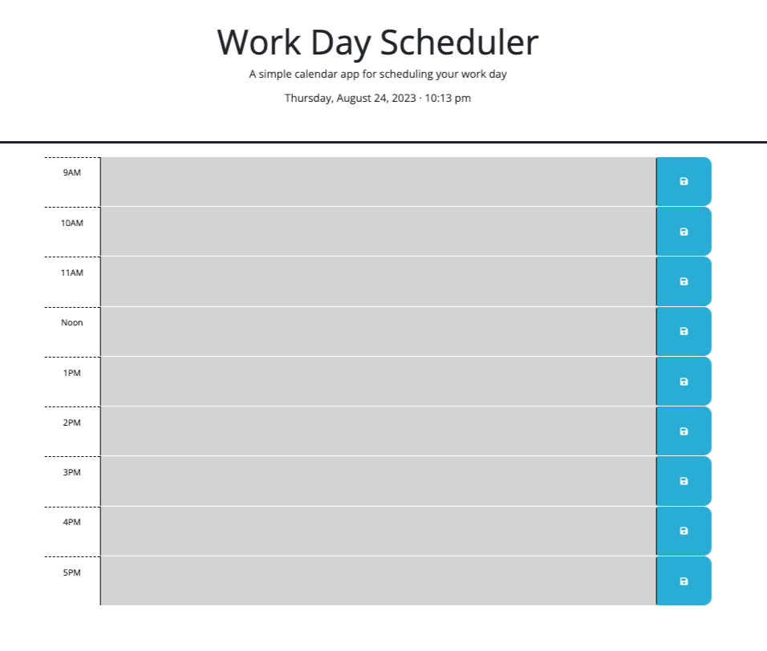

# workday-scheduler
Bootcamp Homework 5: Work Day Scheduler (Third-Party APIs)

## My Workday Scheduler

In this project, we were asked to modify a starter code to create a simple calendar application that allows a user to save events for each hour of a typical working day (9am–5pm). 

When the page loads, the current date and time are displayed at the top of the page. The day calendar is also displayed on page load.

Each row represents an hour of the day (.time-block). When the user enters an event for each row and clicks the save button, a "Saved!" message is displayed just below the date and time. The data entered is then recorded in the local storage. When the page loads, the information saved in the local storage is displayed on the page accordingly.

Each row (.time-block) is color coded based on past (gray), present (red), or future (green) states. The states are determined by comparing the current hour to the numerical portion of the id assigned to each row (.time-block). If the *hourRow is less than the hourOfDay*, the class "past" is appended to the .time-block. If the *hourRow is equal to the hourOfDay*, it adds a class "present" and removes the class "past" to the .time-block. *Otherwise*, the classes "past" and "present" are removed and the class "future" is added to the .time-block. 

## Resources

I used the following references for this assignment:

**Day.js** (https://day.js.org/docs/en/display/format) to display the current date and time.

I referred to our Javascript lessons and activities for this assignment. 

I also used MDN web docs for reference when using the *localStorage* property, *split()* and *setTimeout()* methods, and a function's *this* keyword. 

## My Application Screenshot

## Mockup Provided

## URLs submitted

My Repo URL: https://github.com/lenzlee/workday-scheduler

Application URL: https://lenzlee.github.io/workday-scheduler/